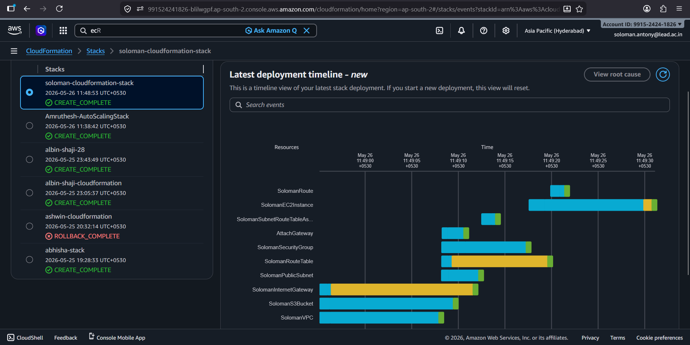
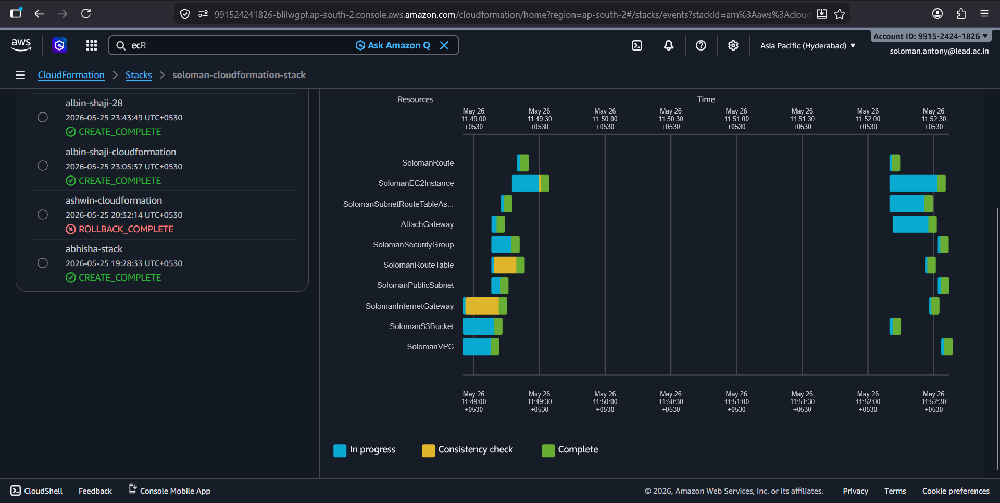

# AWS CloudFormation - VPC, EC2 and S3 Setup

This project demonstrates how to use AWS CloudFormation to automatically provision AWS infrastructure resources including:

- VPC
- Public Subnet
- Internet Gateway
- Route Table
- Security Group
- EC2 Instance
- S3 Bucket

---

# Project Architecture

```text
Internet
   ↓
Internet Gateway
   ↓
Route Table
   ↓
Public Subnet
   ↓
EC2 Instance
```

An S3 bucket is also created using the same CloudFormation template.

---

# Files in Repository

```text
.
├── README.md
├── template.yml
└── screenshots
    ├── create_complete.png
    └── create_complete.png
```

---

# AWS Services Used

- AWS CloudFormation
- Amazon VPC
- Amazon EC2
- Amazon S3

---

# Prerequisites

Before deploying the stack:

- AWS Account
- AWS CloudFormation access
- EC2 Key Pair created in the same region

---

# Deployment Steps

## 1. Open AWS CloudFormation

Go to AWS Console → CloudFormation

---

## 2. Create Stack

- Click **Create Stack**
- Choose **With new resources**
- Upload `template.yml`

---

## 3. Configure Stack

Enter stack name:

```text
soloman-cloudformation-stack
```

Click **Next** and then **Submit**.

---

# Resources Created

The template provisions:

- Custom VPC
- Public Subnet
- Internet Gateway
- Route Table
- Security Group
- EC2 Instance
- S3 Bucket

---

# Screenshots

## Stack Creation Complete



## Stack Deletion Complete



---

# Cleanup

To delete all created resources:

1. Open CloudFormation
2. Select the stack
3. Click **Delete**

> Note:
> If the S3 bucket contains objects, empty the bucket before deleting the stack.

---

# Author

**Soloman Antony**